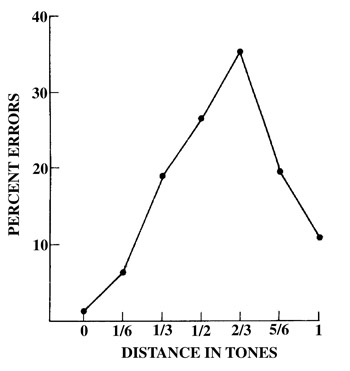

# Overanalyzing the perfect cadence

A brief and informal introduction to a fundamentalist, [Zermelo–Fraenkel](https://en.wikipedia.org/wiki/Zermelo%E2%80%93Fraenkel_set_theory)-esque approach to functional harmony of the European/Western music tradition.

> Recommended viewings/readings:
>
> - [[Youtube] Can an Octave Sound Dissonant (Objective Harmony)](https://www.youtube.com/watch?v=wg5QcF2akzQ&ab_channel=ObjectiveHarmony)
> - [[Book] On the Sensations of Tone (John Ellis, Hermann von Helmholtz)](https://www.amazon.sg/Sensations-Hermann-Ludwig-Ferdinand-Helmholtz/dp/0486607534/ref=asc_df_0486607534/?tag=googleshoppin-22&linkCode=df0&hvadid=594253986426&hvpos=&hvnetw=g&hvrand=13411343694138907540&hvpone=&hvptwo=&hvqmt=&hvdev=c&hvdvcmdl=&hvlocint=&hvlocphy=9062515&hvtargid=pla-451189330065&psc=1)
> - [[Book] Textbook of Harmonics (Hans Kayser)](https://hanskayser.com/EZ/hk/hk/ice-book-textbook-of-harmonics.php?PHPSESSID=cnjbgob76puthjdurpq26g6fu2&scrolly=575&item=346)
>
> Tons of links of videos, papers, and articles within this document, have a look at them. Preferably, use Chrome as some links are to specific fragments which is currently only a feature that chrome supports.

## Part I. Deconstruction

> In this section, we derive the ['axioms'](https://en.wikipedia.org/wiki/Axiom) of functional harmony by observing a G dominant 7 to C major resolving cadence (in the tonal center of C) from various perspectives. Apart from naming conventions, forget all preconceptions about functional analysis and chords.

### Renaissance cadence theory

The early conception of 'resolution' comprised of individual voices moving by specific intervals, rather than chords. These were known as 'clausula' but we shall refer to them as 'movements' in this writing.

Each cadential movement (a single monophonic voice moving from one note to another) is given a name. [See Early Music Sources's video/article](https://www.earlymusicsources.com/youtube/cadences)

Based on the one-step authentic cadence, which in present theory is known to be the basic V-I perfect cadence, we have these movements:

- D &rarr; C: Tenorizans durum clausula
- B &rarr; C: Cantizans clausula
- G &rarr; C: Bassizans clausula
- (G &rarr; E: Altizans clausula)
  - This is considered as an extraneous part in renaissance theory, and as later explained in section 2., actually does not constitute a 'movement'.

The dominant 7th resolves according to the one-step plagal cadence.:

- F &rarr; E: Tenorizans molle clausula (plagal cadence)

> Disclaimer: Here we're forcing the dominant 7th to fit into the renaissance paradigm. The tenorizans molle movement would almost always be found in the context of a IVm-I plagal cadence (Dm resolving to A maj), so it could be seen as a period-incorrect retrofit, or borrowing the relative minor key. However, during the transition between the renaissance and baroque, Monteverdi (1567 - 1643) is known to have used this exact movement in the same context as we are. By the Baroque period, the dominant 7th as an unprepared dissonance has been normalized.

It could also be seen as the altizans of the tenor cadence, though the 'altizans' was normally attributed to being 'filler', so viewing it in this context may not necessarily be accurate:

- F &rarr; E: Altizans clausula (tenor cadence)

> Note: these movements were found a priori by means of experimentation with musical sensitivity, and spread through teaching, discussions, and rebuttals of treatises. During this period, there were no conceptions built around chords, keys, tonality, nor a consensus on tuning system.

### Pitch memory

> See [Prof. Diana Deutsch's 'pitch memory'](https://deutsch.ucsd.edu/psychology/pages.php?i=209)

Before going further, we need to take a detour and understand 'pitch memory', and realize how fundamental the renaissance conception of harmony is to contemporary eurocentric music.

In short, Deutsch's work shows empirical proof of the ability of both musically trained and untrained to commit the frequencies of pitches in external stimuli to a short term memory, and how specific conditions cause an increased probability of certain pitches in the short term memory to be forgotten/reinforced.

We can extrapolate from 'pitch memory' that the presence of new pitches that are intervalically 'close' to prior pitches stored in the short term memory causes an increase in probability that the listener forgets the old pitch, and conflates the new pitch as the old one.

Specifically, 'close' can be defined as the intervals that cause increased error/forgetting in the pitch memory as shown in the following figure (Deutsch, [_Short Term Memory For Tones_](https://deutsch.ucsd.edu/psychology/pages.php?i=209)):

Relating this back to section 1, we can see how the renaissance concept of how the 'altizans' is a non-crucial voice in the authentic cadence has empirical backing as minor thirds do not 'move' pitches in the short term memory as much as other intervals.

Now, symmetries can be drawn between the 'voice movement' concept of renaissance functional harmony and how nearby intervals can cause 'movement' in the short term memory.

From this, we can say:

- Octave-equivalence does not apply when considering horizontal resolutions of harmony. (i.e. in the context of a homophonic chordal accompaniment, chord voicings are important, and octave choice is not arbitrary)

- We hear harmonic 'colour changes' in accordance to how the short term memory is affected by present stimuli.

### Just intonation analysis

> Recommended prerequisite knowledge on [just intonation](https://marsbat.space/pdfs/JI.pdf) representations of intervals:
>
> - [overtone/harmonic series (musical definition)](https://www.youtube.com/watch?v=hDLhe-NkH2A&ab_channel=mannfishh)
> - [intuition for the just intonation lattice](https://www.youtube.com/watch?v=ZJfAVSVgaSI&ab_channel=mannfishh)
> - [prime factorization](https://www.cuemath.com/prime-factorization-formula/)
> - [adding and subtracting intervals](https://www.kylegann.com/tuning.html)
>   - in summary: let R be the fraction that represents a particular interval, and let F be any pitch in Hz. To raise F by an interval, multiply F by R. To lower F by an interval, divide F by R.
> - ['p-limit'](https://en.xen.wiki/w/Harmonic_limit) definition
>   - in summary: let [ℚ](https://en.wikipedia.org/wiki/Rational_number) be the set of all just intervals. If a musical concept/construct only considers intervals in the subset of ℚ where all intervals in the subset can be generated as the product of primes (or their reciprocals) such that no prime exceeds **p**, the system is said to be '**p**-limit'.
> - (Optional) [names & cent distances of just intervals](https://en.xen.wiki/w/Gallery_of_just_intervals)

First, let us analyse the notes of the chords G dominant 7 and C major vertically with respect to the fundamental pitch of C. Vertical analysis is ultimately an analysis of [harmonic entropy](https://en.xen.wiki/w/Harmonic_entropy) and 'colour' (i.e. intervals that are not solely composite of powers of 2). Note that there are many possible choices when it comes to finding a just intonation representation of notes in 12edo (we are 'detempering' a tempered tuning system into an untempered just tuning). We shall use just intervals that are 'closest' to the fundamental C (such that it minimizes its [_height_](https://en.xen.wiki/w/Height), explained later) and constrained within the [5-limit](https://en.wikipedia.org/wiki/Five-limit_tuning) (recall the definition of p-limit). Since we are vertically analysing for colour, we assume octave equivalence (powers of 2 in prime factorization are arbitrary)

> Side note: detempering involves undoing the [mathematical coincidences](https://en.wikipedia.org/wiki/Mathematical_coincidence#Concerning_musical_intervals) we exploit between irrationals and rationals.
>
> For more information, see [tempering](https://en.xen.wiki/w/Tempering_out) and [detempering](https://en.xen.wiki/w/Detempering) on the xenwiki.

C major:

- C: 1/1
- E: 5/4
- G: 3/2

G dominant 7:

- G: 3/2
- B: 15/8
- D: 9/4
- F: 8/3

We can also put all these frequency ratios as a compound ratio, representing the frequencies with respect to each other:

- C major: 4:5:6
- G dominant7: 36:45:54:64

Based on the vertical ratios, we can intuitively see that G dominant 7 has greater complexity as compared to C major, thus that gives us a directed resolution that makes it obvious which one of the two is the 'tension' and which one is the 'release'. These ratios can be thought of as structures present in the sound pressure waves in the air.

We can already make the observation that the simplest vertical structures would arise from choosing intervals that are part of the same overtone series; if notes were chosen from varying overtone series, the compound ratio would have to accommodate for common factors that are missing between selected fundamentals of the varying overtone series.

> Disclaimer: This vertical analysis is slightly flawed because we assumed the just intonation interpretations of originally non-just intervals. The ideal goal would be to deconstruct the 12edo equal-tempered variant of the perfect cadence, as-is. However, that involves polyadic [harmonic entropy](https://en.xen.wiki/w/Harmonic_entropy), which to summarize, is a means of modelling cognitive discordance by taking a probabilistic view of the auditory cortex interpreting pitch stimuli as particular interval ratios instead of any other similar interval ratios and applying concepts from information entropy to measure how much harmonic information is given by input stimuli.
>
> Harmonic entropy can be thought of as a 'general formula' for calculating discordance of a static vertical chord voicing. The computation is beyond the scope of this writing, but it is good to know that the intuitive 'complexity' we are using still holds true even when using harmonic entropy for our current example.
>
> There are also known metrics of objectively scoring discordance between just intonated interval ratios, which are known as [height functions](https://en.xen.wiki/w/Height). When a just interval is said to be relatively 'complicated' or 'discordant', the height function would yield a relatively larger score. In number theory, height functions quantify the [complexity of objects](https://en.wikipedia.org/wiki/Height_function).
>
>> Disclaimer's disclaimer: polyadic entropy/height measuring functions assume a cultural bias toward the harmonic series (because it is present in all 1-dimensional resonance systems); However, for music based off of inharmonic partials of [rectangular](https://www.researchgate.net/publication/310744242_An_Analytical_Solution_to_Free_Rectangular_Plate_Natural_Vibrations_by_Beam_Modes_-_Ordinary_and_Missing_Plate_Modes)/[spherical](https://en.wikipedia.org/wiki/Spherical_harmonicshttps://en.wikipedia.org/wiki/Spherical_harmonics) surfaces (e.g. Gamelan), using measures based on the [Critical Bandwidth (Plomp & Levelt)](https://www.mpi.nl/world/materials/publications/levelt/Plomp_Levelt_Tonal_1965.pdf) model (like the [Sethares algorithm](https://sethares.engr.wisc.edu/consemi.html)) has much better effectiveness as demonstrated [here](https://www.youtube.com/watch?v=ksX-saQVL40&ab_channel=ObjectiveHarmony).
>
> Note that there is still merit to continuing the analysis in just intonation as these specifically chosen just interval representations have the highest probabilities of being perceived and detempered by the auditory cortex as the input stimuli 12edo tempered intervals. However, a full analysis would require one to perform the following observations on all other possible just interval representations (e.g. 21/16 ([octave-reduced](https://en.xen.wiki/w/Octave_reduction) 7th harmonic of G) instead of 4/3 for the note F4 in G3 dominant 7 taken w.r.t. C4), though it would yield similar conclusions.

Now let us analyse the horizontal voice movements in section 1 in just intonation. Recall that octave-equivalence does not exist here.

- B &rarr; C: Cantizans (authentic) ascends by a classic diatonic semitone (16/15) to go from 15/16 to 1/1.
  - This is a strong voice movement according to 'pitch memory'. The semitone is the strongest possible intervallic movement in 12 edo.
  - B (15/16) moves from a relatively more complicated interval (greater [_height_](https://en.wikipedia.org/wiki/Height_function)) with respect to the tonal center (C), to C (1/1) which is the simplest possible interval with respect to the tonal center.
  - 15/16 is the (octave-reduced) 15th harmonic of the overtone series of the fundamental.
  - Note: the original clausula around the 13th century involves perceiving the semitone as the difference between the perfect fourth (4/3) and the Pythagorean ditone/maj 3rd (81/64), yielding the Pythagorean limma (256/243), however in the modern context this movement is more often tuned from the classic major third of the fifth (5/4 * 3/2 = 15/8).

- D &rarr; C: Tenorizans durum (authentic) descends by a Pythagorean major second (9/8) to go from 9/8 to 1/1.
  - This is a weaker movement in 12 edo compared to the semitone
  - D (9/8) moves from a relatively more complicated interval to unison (1/1) w.r.t. the tonal center (C)
  - 9/8 is the (octave-reduced) 9th harmonic of the overtone series of the fundamental.

> Note that there are two ways of viewing the tenorizans molle. We can see it the 'modern'/Monteverdi way which would be moving from the P4th to M3rd scale degree, or in the original context it was used in, which would be moving from the classic minor 3rd of the fourth (6/5 * 4/3 = 8/5) to the P5th.

- F &rarr; E: Tenorizans molle (plagal)/Altizans (tenor) ('modern' POV): descending by a classic diatonic semitone (16/15) to go from F (4/3) to E (5/4).
  - strong movement
  - F (4/3) is simpler than E (5/4), w.r.t. the tonal center (C)
  - 4/3 is not in the overtone series of the fundamental.
  - From this perspective, the tenorizans molle is an outlier - the resolved note is technically more 'complex' than the 'tension' note. This is analogous to the argument of why (and when) the Perfect 4th interval was considered to be a dissonance in species counterpoint/common practice era.

- F &rarr; E: Tenorizans molle (renaissance plagal POV): descending by a classic diatonic semitone (16/15) to go from F (8/5) to E (3/2), with implied fundamental being A (1/1)
  - strong movement
  - F (8/5) is more complex than E (3/2) w.r.t. the tonal center (A)
  - 8/5 is not in the overtone series of the fundamental.
  - From this POV, it makes sense why this particular movement is formalized in renaissance theory in this context rather than the 'modern' context above. However, primodal tonality (explained later) allows us to 'borrow' these 'prime-modes', so they can be perceived from either viewpoint depending on context. (Not to be confused with the arbitrarily and vaguely defined 'modal interchange')

- G &rarr; C: Bassizans: descends by a Pythagorean fifth (3/2) to go from G (3/2) to C (1/1).
  - This is not considered a movement as both G and C can live concurrently in pitch memory without additional error/forgetting above the baseline.
  - G (3/2) is more complex than C (1/1) w.r.t. C.
  - 3/2 is the (octave-reduced) 3rd harmonic of the fundamental.
  - Fulfils the function of sounding the relative fundamentals of each vertical chord. Note that by the psychoacoustic phenomenon of [combination tones](https://en.wikipedia.org/wiki/Combination_tone), [virtual fundamental](https://en.wikipedia.org/wiki/Virtual_pitch), [the dynamic nature of pitch perception](https://www.pnas.org/doi/10.1073/pnas.081070998), and [the emergent entrainment](https://www.biorxiv.org/content/10.1101/2021.10.20.465101v1) of [stochastic resonance](https://academic.oup.com/ptp/article/102/6/1057/1923010), these fundamental notes are already psychoacoustically present when harmonics (or sufficiently close approximates of harmonics) of them are sounded.
  - The perfect 5th is the simplest non-octave interval. It is also the only [super particular ratio](https://en.wikipedia.org/wiki/Superparticular_ratio) where its numerator and denominator are primes.

## The axioms

- All intrinsic physiological/logical factors
  - dynamics of the basilar membrane, transfer function of outer & inner ear
  - [auditory nerve activation](https://www.ncbi.nlm.nih.gov/books/NBK11105/)
  - neuron activation & emergent systems
  - stochastic resonance
  - number theory
- the listener may make a conscious or unconscious decision (informed by cultural entrainment, free will, or cognition) to give importance to certain input frequency stimuli over others such that [perceived entropy is minimized](https://www.quantamagazine.org/anil-seth-finds-consciousness-in-lifes-push-against-entropy-20210930/)
- short term pitch memory exists (Deutsch), giving rise to the notion of voice leading/movements
- certain intervals (approx. between 66 and 166 cents) are more likely than others to cause movement
- the 4 harmonic/pitch-based measures of 'complexity'
  - height functions (for a rational interval/chord, assuming culturally entrained affinity to the rationals (harmonic series))
    - Benedetti, Tenney, Weil, Wilson, Euclid, Faltings, etc...
  - harmonic entropy (for an irrational interval/chord, built on intrinsic physiological/psychoacoustic phenomenon of [concordance](https://en.xen.wiki/w/Harmonic_entropy#Background))
    - Paul Erlich, Steve Martin, Mike Battaglia, Keenan Pepper,  Lilian M. Hearne, etc...
  - critical bandwidth dissmeasure
    - Plomp, Levelt, Helmholtz, Ohm, Sethares, Vassilakis, Cook, Benson, Dillon, etc...
  - [spectral entropy](https://dsp.stackexchange.com/questions/23689/what-is-spectral-entropy) (for complexity of timbre/[signal-noise ratio](https://en.wikipedia.org/wiki/Signal-to-noise_ratio))
    - information entropy applied to spectra
    - Shannon, Renyi, [Lebesgue measures](https://www.youtube.com/playlist?list=PLBh2i93oe2qvMVqAzsX1Kuv6-4fjazZ8j), Riemann (Zeta function) for more advanced generic calculations
- the fundamental infinite tonal structure of oscillations in 1 dimension is the harmonic series
  - [Leonard Bernstein on the universality and etymology of the harmonic series in music](https://www.youtube.com/watch?v=8fHi36dvTdE)
  - [Hans Kayser on the pervasiveness of the harmonic series](https://hanskayser.com/EZ/hk/hk/hans-kayser-science.php?PHPSESSID=m7cp1gjrn1lah5f32ico3e8v5f)

## Part II. Present-day conflicts

Though initially obscured, conflicts soon arise between the axioms and paradigms in use by contemporary musicians. Due to the numerous mathematical coincidences in the [tempered-out commas](https://en.xen.wiki/w/Tempering_out) of the 12 equal divisions of the 2nd harmonic (12edo/ed2), the tuning system has immense harmonic leniency and symmetry that is unparalleled. In a sense, 12ED2 is the mathematical ideal end-game tuning system that specifically optimizes for minimal notes while allowing for symmetries of cofactors 2, 3, 4, 6; tempering out the syntonic and Pythagorean commas; and is an [optimal zeta edo](https://en.xen.wiki/w/The_Riemann_zeta_function_and_tuning#Zeta_EDO_lists) (i.e., the 'average tuning discrepancy' between intervals of the EDO and the harmonic series is at local minima when made into a continuous function across N edos).

Over time, this leniency birthed a new consensus in the western classical paradigm which assumes all these symmetries and mathematical coincidences, elevating the 'ground truths' to concepts like major scales, cadences, etc...

These ground truths are not _incorrect_ of their own accord &mdash; _incorrect_ being itself impossible to define &mdash; but knowledge of the rational process of its conception has lost its importance in the contemporary school. Contemporary music education is now constructed on the abstracted and unstable ground of chord-scale theory, scales, modes, symmetries, and cultural constructs, yielding to further [self-referential](https://plato.stanford.edu/entries/self-reference/) abstractions as briefly listed below:

### Assumption of octave equivalence

Counterexamples:

- [dissonant pure octaves due to inharmonic spectra](https://www.youtube.com/watch?v=wg5QcF2akzQ&t=493s&ab_channel=ObjectiveHarmony)
- [ancient greek genus](https://earlymusicseattle.org/greek-musical-theory/)
- [turkish makam](https://en.wikipedia.org/wiki/Turkish_makam)
- [arabic maqam](https://www.maqamworld.com/en/maqam.php)
- [historic chinese temperament (Later Han)](https://www.youtube.com/watch?v=51WG9XTkUfg&t=1534s&ab_channel=JuniL.Yeung)
- [gamelan (Anglirmendung)](https://open.spotify.com/track/6VVUd8IQmXN28XIMjlLVP1?si=97d0f9817a1f4b2c)
- implications of octave choice in chord voicings due to [combination tones](https://www.youtube.com/watch?v=saJeTRnBoeM&ab_channel=ComposingGloves), [virtual fundamental](https://www.youtube.com/watch?v=t-iWKvh6Fbw&ab_channel=MusicalAcoustics), and voice leading
- the [Tzimane](https://www.cell.com/current-biology/fulltext/S0960-9822(19)31036-X?_returnURL=https%3A%2F%2Flinkinghub.elsevier.com%2Fretrieve%2Fpii%2FS096098221931036X%3Fshowall%3Dtrue)

### Duality

To briefly summarize, Riemannian [Duality](https://www.tandfonline.com/doi/abs/10.1093/jrma/29.1.21?journalCode=rrma18) is the paradigm of equity of the perfect and plagal 'sides'. The minor scale is understood as the major scale backwards, with motivated by the coincidence of the minor-major modal congruency because of 12-tone temperament, and later by visual symmetries in the [Tonnetz](https://en.wikipedia.org/wiki/Tonnetz). This inevitably inspires Partch to the [otonal-utonal](https://en.wikipedia.org/wiki/Otonality_and_Utonality) paradigm.

The [Gradus Suavitatis](https://mathematik.com/Piano/) (and other modern rational based height functions) appears to support the [case for duality](https://youtu.be/B6Dvfv_ASVg?t=341). However, such height functions models solely the numerical complexity, but doesn't take into account the collective [psychoacoustical complexity metric](https://en.xen.wiki/w/Harmonic_entropy#:~:text=For%20instance%2C%20Paul%20Erlich%20has%20noted%20that%20most%20models%20for%20beatlessness%20measure%2010%3A12%3A15%20and%204%3A5%3A6%20as%20being%20identical%2C%20whereas%20the%20latter%20exhibits%20more%20timbral%20fusion%20and%20a%20more%20salient%20virtual%20fundamental%20than%20the%20former) of concordance that is modelled in Erlich's harmonic entropy.

Any cadence/motion/excerpt and its inverse dual be effective in communicating functional movement, by virtue of the symmetries and leniency of 12 edo; though the rationale behind the functional movements of the dual will differ greatly &mdash; the axiom of psychoacoustic phenomenon yields a different set of [combination tones](https://soundcloud.com/yinbell/periodicity-buzz-study) suggesting a different basis of frequencies that will imply a separate tonal center that has to be regarded independent of its originating dual.

Outside the symmetries of 12 edo, one has to consider if the temperament may support the particular flavour of 'duality' of choice.

### Non-universality of functional equivalence

The original conception of musical function was done without notion of temperament ([_Traité d'harmonie_](https://www.loc.gov/resource/muspre1800.101402/?sp=5), Jean-Philippe Rameau 1722).

However, much of present day functional analysis from both [Schenkerian](https://francis-press.com/uploads/papers/9hq2ZZi0ZTkUlbfnjFsuRcQiIrCiLUCIDulcd6xR.pdf) and [Riemannian](https://en.wikipedia.org/wiki/Neo-Riemannian_theory) schools assume an equivalence that is reliant on the tempered commas of well-temperament (or similar).

To give a tangible example from the Riemannian paradigm (duality), let's study the [relative](https://en.wikipedia.org/wiki/Neo-Riemannian_theory#Triadic_transformations_and_voice_leading) transformation on C major, that is A minor. Recall that we are no longer working within any temperament system, but with just intervals instead.

Here is the C major scale as a chain of two fifths (3:2) that are 1 (5:4) major third apart, octave reduced, as tuned from "F lydian" (Byzantinian liturgical mode C lydian, diatonic genus):

- C 1:1 (1st fifth of root)
- D 9:8 (3rd fifth of root)
- E 5:4 (1st fifth of third)
- F 4:3 (root)
- G 3:2 (2nd fifth of root)
- A 5:3 (third)
- B 15:8 (2nd fifth of third)

And now A minor, as a relative transformation:

- A 1:1
- B 9:8
- C 6:5
- D 4:3
- E 3:2
- F 8:5
- G 16:9

So far, nothing seems to be wrong. Until, we look at the above, relative scale from the perspective of C = 1:1

- A 5:3
- B 15:8
- C 1:1
- **D 10:9**
- E 5:4
- F 4:3
- G 3:2

The note D has changed &mdash; in C major, D is the 3rd fifth of F, but in the relative transform, D is 1 fifth below A. This is the [syntonic comma](https://www.youtube.com/watch?v=XhY_7LT8eTw&ab_channel=EarlyMusicSources), which is tempered out in all [meantone temperaments](https://en.xen.wiki/w/Meantone_family). Meaning, such a transformation would only work within the context of meantone temperaments, and should only be applied when the underlying harmonic constructs are based on meantone constructions (i.e. intervals relating 3:2 to 5:4 or 6:5).

As a tangible example, applying any of the neo-Riemannian substitutions to a Tonic-functioning dominant7th-esque chord within the context of the blues would yield a "period-incorrect" colour, since the musical tradition implies tempering of relations between the [5th](https://en.xen.wiki/w/5/4), [7th](https://en.xen.wiki/w/7/4) and [11th](https://en.xen.wiki/w/11/8) harmonics via the [Mothwellsma](https://en.xen.wiki/w/99/98) comma, [Orwell](https://en.xen.wiki/w/Orwell)/Mothwellsma-related temperaments, or others.

### Negative Harmony

> For information on this subject, see [this video](https://www.youtube.com/watch?v=ZAmEaTFcJCE&ab_channel=PhilippGerschlauer) by Philipp Gerschlauer

For the same reason as presented above, negative harmony only works when the applied harmonic substitutions are within constraints of a particular temperament, or;

if the octave-reduced harmonic lattice (e.g. in 5-limit music, the 2-dimensional [Tonnetz](https://en.wikipedia.org/wiki/Tonnetz) or [Lambda](https://hanskayser.com/EZ/hk/hk/hans-kayser-lambdoma.php?PHPSESSID=gdqq52v7083njaaq8h4ogef3fc)) has mirror-symmetry about the axis/plane that is [orthogonal](https://www.google.com/search?q=orthogonal) to all basis vectors (i.e. the [Monzo](http://www.tonalsoft.com/enc/m/monzo.aspx) of [1 1 1 1 ...>).

The fact that the 'negative' transform of a C major scale taken about its root note can generate exactly the fifth mode of its natural minor with the root a fifth below (F minor/C phrygian, modern modal definition) is part of the leniency of the symmetrical 12-tone system.

The general solution to negative harmony given is out of scope of this article, but to get started, the generalized conception would require:

- [Fokker periodicity blocks](https://en.wikipedia.org/wiki/Fokker_periodicity_block)
- [Finite Abelian groups](https://groupprops.subwiki.org/wiki/Finite_abelian_group)
- Solving of [simultaneous diophantines](https://en.wikipedia.org/wiki/Diophantine_equation#System_of_linear_Diophantine_equations), within a quotient subspace (that depends on the temperament) of the field R^n in p-limit harmony where p = nth prime.

### (not free) Atonality

To paraphrase Bernstein, the divided school of expressionists (Scriabin v. Schoenberg) had common ground in the search for greater expressive capability that is still contained within a formal system with structure.

The matrix operations and strict/semi-strict ordering of dodecaphony/serialism is mathematically the best response to the rejection of tonality. By having less deviation between the probabilities/frequencies of the 12 notes occurring, the entropy of pitch classes is maximized.

Besides octave equivalence, this formal system of serialism is an endomorphism of harmony itself to [D24](https://groupprops.subwiki.org/wiki/Dihedral_group:D24) x [S2](https://groupprops.subwiki.org/wiki/Cyclic_group:Z2), which is a complete rejection of the [logarithmically perceived](https://youtu.be/EmP9HdzM6YI?t=294), non-[cyclic](https://en.wikipedia.org/wiki/Cyclic_group), asymmetric basis of the perception of musical frequencies and pitches in the context of [tones](https://cdn.head-acoustics.com/fileadmin/data/global/Application-Notes/SVP/Tonality-Hearing-Model-07.2018.pdf) (note: psychoacoustic 'tonality' not to be confused with musical 'tonality'). Without control over time, there is no way to create a [smooth](https://en.wikipedia.org/wiki/Smoothness) [bijective](https://en.wikipedia.org/wiki/Bijection) map from spectra to the operations of serialism. (Simple proof left as an exercise to the reader).

Because of [Cantor's paradox](https://en.wikipedia.org/wiki/Cantor%27s_paradox), given pitches in the set of all reals, the serialist approach is no longer definable.

Thus, the motivation behind atonality is the antithesis of this article, since this article is about extending expressive capability within the formal structure of physiologically/logically-intrinsic concepts.

### Digression

Once again, there is nothing inherently wrong with these constructs within the context of present-day tuning. However, knowing their inner workings gives clues to when such constructs are effective &mdash; the nature of their application in both sound, culture, and in pure number theory &mdash; as opposed to being resorted to as the 'quadratic equations' of music. A future article will cover an extrapolated and reified application in further detail.

## Part III. Reconstruction

> Now that nothing is real any more, each individual has to develop their own individual concept of sound.

### Tonality

In the ideal world, tonality is the way existence can be. Or assuming existence follows no rules, then it is all the ways [rules may manifest](https://www.youtube.com/watch?v=RnqwFpyqJFw&ab_channel=RichardE.BORCHERDS), as long as they count as the incomplete rules of expectation and subversion.

Assuming this definition, tonality would then be a spectrum encompassing the interval from abstract to fundamental. Atonality is the epitome of disregard for the fundamental by an attempt to manifest the abstract, yet now it is within tonality. At the other end, we have the search for the fundamental.

> I assume _fundamental_ to be defined with the physiological axioms of perception of pitch, timbre, harmony, and psychoacoustic phenomenon, not that of perception of structure or form. Unfortunately, the subjectivity of these psychoacoustic experiments and the human experience is technically still an unstable self-referential foundation.
>
> Since we experience music through time and through conscious being, there is a state of tonality that cannot be modelled, the result of having to perceive through the lens of human perception. The intrinsic factors can be modelled (height functions, entropy, circular maps, dynamic resonance, bayesian statistics etc.), but the extrinsic factors involve knowledge of cultural entrainment (long-term memory) and free will to direct attention to particular frequencies over others, which then ultimately contributes to the looser terms like being 'melodic' or having strong 'phrasing'.
>
> Invariant to the reification of the concept, one has to take into account additional cultural factors that affect perception of tonality.
>
> It is fair to assume that ears from the eurocentric culture will not be able to discern intended dissonance in a raag when the characteristic [swara](https://en.wikipedia.org/wiki/Svara)/[gamakas](https://en.wikipedia.org/wiki/Gamaka_(music)) of the raag is not adhered to ([vivadi](https://en.wikipedia.org/wiki/Vivadi)); when note/tuning substitutions are made within a makam; when the rhythmic downbeat is subjectively interpreted causing listeners to hear a different [tonality](https://open.spotify.com/track/2CtCCTCdk8plkJ1mfrHSK2?si=80d733858dcd48f4)/[resolution](https://open.spotify.com/track/53R2oPyXmdT4pVZqUOe7Dr?si=7e73077840ac4c33) than intended.

The evolution of music across cultures and time shows the free choice that an individual has to choose a point along this 'tonality axis' to delve in.

On the opposite end of the abstract, we can define see tonality in terms of the harmonic series itself, the set of positive integers, manifested as integer multiples of an arbitrary base fundamental frequency. Pairs taken from this set will generate all rational intervals, which by [Weber's law of Just Noticeable Difference](http://apps.usd.edu/coglab/WebersLaw.html), would effectively be perceived as [all the intervals that may exist](https://www.youtube.com/watch?v=cyW5z-M2yzw&ab_channel=3Blue1Brown).

However, we can also choose to tonicise any translation offsets or subsets of the harmonic series by choice, starting on any 'artificial fundamental', or leaving gaps and purposefully omitting a certain prime ([Bohlen Pierce](https://www.youtube.com/watch?v=BJkd6gdT1H0&ab_channel=JohnMoriarty), [Carlos' Alpha/Beta/Gamma](https://www.wendycarlos.com/resources/pitch.html)). This notion is extrapolated in [the theory of primodality](https://www.youtube.com/watch?v=KKxXdD-lkwI&ab_channel=ZheannaErose).

To give an example, a resolution to a minor tonality in 12edo could be utilized as resolutions to several numerical structures:

- primemode-10 classic minor (10:12:15 5-limit)
- primemode-6 septimal subminor (6:7:9 7-limit)
- primemode-16 novemdecimal minor (19-limit 16:19:24)

And the list extends to infinity by means of the [Farey sequence](https://en.wikipedia.org/wiki/Farey_sequence) and [mediants](https://en.wikipedia.org/wiki/Mediant_(mathematics)). Each interpretation requires a different harmonic treatment that is consistent to the underlying (conscious/subconscious) numerical concept of the composer.

To summarize, tonality depends on what frequencies are being reinforced in the short term memory, and the reinforcement of frequencies are seen through the filter of intrinsic factors (objective concordance and ease of perception of intervals), but also through cultural reinforcement of patterns and clichés.

## (subjective, personal) Conclusion

- Concealed within 12 edo is the full history of the entrainment of the western music school.
- Knowldege of physiological perception + entrainment allows the full exhaustion of tonality within the cultural context of the entrainment.
- And that of beyond 12 edo.
- 