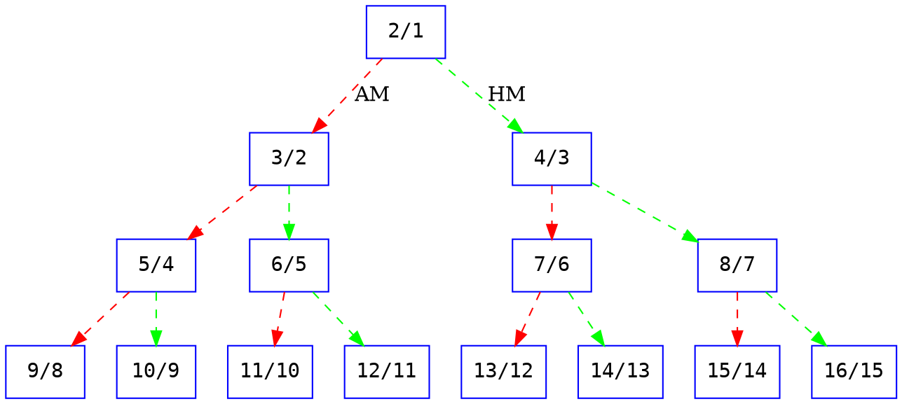

# The Pythagorean Means: a very short intro to Just Intonation



~ euwbah Jan 8 2024

-----

<blockquote class="twitter-tweet">
A nice geometric way of viewing the arithmetic, geometric, and harmonic means of two numbers. It is also easy to see that A&gt;G&gt;H. <a href="https://t.co/66J0UKFBv9">pic.twitter.com/66J0UKFBv9</a>
&mdash; Dave Richeson (@divbyzero) <a href="https://twitter.com/divbyzero/status/1039629625985564672?ref_src=twsrc%5Etfw">September 11, 2018</a></blockquote> 

The [Pythagorean means](https://en.wikipedia.org/wiki/Pythagorean_means) are three types of "averages" that served as cornerstones of the classical Greek concept of musical intonation (and geometry). It's super helpful to build an intuition for these before diving into Archytas, Ptolemy, etc... and really useful for just intonation in general.

## 0. Clearing misconceptions

We perceive musical intervals as the ratios between frequencies, not the difference between frequencies.

The interval between 100 Hz and 200 Hz is an octave (2:1 frequency ratio), but that of between 200 Hz and 300 Hz, although again separated by 100 hz, is not an octave, but a perfect fifth, because the ratio is 3:2.

The modern measure of cents and semitones are based on the logarithmic scale (log base 2, where 2 represents the octave as a unit interval because of [octave equivalence](https://en.wikipedia.org/wiki/Octave#Equivalence)), to match our perception of hearing the 'size' of intervals as the ratio between frequencies, not the 'difference' between frequencies.

$$
\begin{align*}
\text{Interval} &= \frac{a \; \text{Hz}}{b \; \text{Hz}} \\
\text{Octave} &= \frac{2}{1} = \frac{200 \; \text{Hz}}{100 \; \text{Hz}} = \frac{400 \; \text{Hz}}{200 \; \text{Hz}} = \cdots \\
\text{Fifth} &= \frac{3}{2} = \frac{300 \; \text{Hz}}{200 \; \text{Hz}} = \frac{600 \; \text{Hz}}{400 \; \text{Hz}} = \cdots \\[1em]
\text{Perceived Octaves} &= \log_{2} \left(\frac{a}{b}\right) \\
\text{Semitones} &= 12 \cdot \log_{2} \left(\frac{a}{b}\right) \\
\text{Cents} &= 1200 \cdot \log_{2} \left(\frac{a}{b}\right)
\end{align*}
$$

## 1. The Monochord

For examples' sake, consider the Monochord below with a 100 cm long string that sounds at 100 Hz when plucked (numbers were made nicer to make examples easier to follow).

<iframe width="560" height="315" src="https://www.youtube.com/embed/9W4jr4CSohI?si=BPZ2Htw1gv9ndYKC" title="YouTube video player" frameborder="0" allow="accelerometer; autoplay; clipboard-write; encrypted-media; gyroscope; picture-in-picture; web-share" allowfullscreen></iframe>

This was both a musical and scientific instrument, and supposedly one the first ever recorded experiments that concerned the scientific method & math applied to music.

Let's say we have a 100cm long string that sounds a 100 Hz when plucked. By halving the length of this string to 50 cm, we get the note one octave above, 200 Hz (e.g. pressing down on the 12th fret on a guitar). Doubling the frequency of a sound gives the simplest possible musical interval (octave) where the frequency of two notes are in a $2:1$ relationship.

<iframe width="560" height="315" src="https://xenpaper.com/#embed:(1)(env%3A1799)(osc%3Asawtooth)_%0A%0A100hz_%23_100_cm%0A200hz_%23_50_cm" title="Xenpaper" frameborder="0" style="height:13em"></iframe>

If we were to write the start of each waveform period as a note, the sheet music would look something like this, sped up to 100 beats per second:

This interval relationship is so simple that these two notes will have been given the same nominal name, distinguished only by octave number (e.g. A3 (220 Hz) vs A4 (440 Hz) is in the $2:1$ ratio).

## 2. The Harmonic Mean

The next 3 sections that introduce the 3 classical means are attempts at this simple question: What if we want to find the note that is 'exactly' in the middle of an octave?

What does in the 'exact middle' even mean? In modern music theory, the tritone divides the octave perfectly into half, which allows us to perform tritone substitution and rationalize the musical function of augmented 6th chords (italian, french, german, neapolitan). How do we achieve the tritone in terms of changing the lenghth of our string?

Intuitively, we may first try to 'average' out the two lengths of string:

$$
\frac{1}{2} \cdot \left(100 \mathrm{cm} + 50 \mathrm{cm}\right) = 75 \mathrm{cm}
$$

If a 100 cm string resounds at 100 Hz, then a 75 cm string, will give an inversely proportional frequency of:

$$
100 \mathrm{Hz} \cdot \frac{100 \mathrm{cm}}{75 \mathrm{cm}} = 133\tfrac{1}{3} \mathrm{Hz}
$$

The relationship between 100 Hz and 133.33 Hz is $4:3$, the perfect fourth.

<iframe width="560" height="315" src="https://xenpaper.com/#embed:(1)(env%3A1799)(osc%3Asawtooth)_%0A100hz_133.333hz-...%0A1%2F1_4%2F3" title="Xenpaper" frameborder="0" style="height:11em"></iframe>

But, this interval, by current music theory standards, falls short of what it means to be 'in the middle' of an octave!

By taking the conventionally "average" string length, what we have obtained is known as the **Harmonic Mean** of the frequencies:

$$
\begin{align*}
\mathop{HM}(a\; \mathrm{Hz}, b\; \mathrm{Hz}) &= \frac{2}{\frac{1}{a} + \frac{1}{b}} \\[1em]
\mathop{HM}(x_1, x_2, \cdots, x_n) &= \frac{n}{\frac{1}{x_1} + \frac{1}{x_2} + \cdots + \frac{1}{x_n}}
\end{align*}
$$

It may not be explicitly clear how the harmonic mean appears in the above example, so here's the working in full:

$$
\begin{align*}
f_\text{open string freq} &= 100 \mathrm{Hz} \\
l_\text{open string length} &= 100 \mathrm{cm} \\
a\;\mathrm{Hz} &= \text{freq. of open string} \\
&= f_\text{open} \\
b\;\mathrm{Hz} &= \text{freq. of half length string} \\
&= \frac{f_\text{open}}{l_\text{half str. len.} / l_\text{open}} \\
&= \frac{f_\text{open}}{50 \mathrm{cm} / 100 \mathrm{cm}} \\
&= \frac{f_\text{open}}{1/2} \\
&= 2 \cdot f_\text{open} \\
\implies \frac{l_\text{open} \cdot f_\text{open}}{l_\text{half}} &= b \\
\implies \frac{1}{b} &= \frac{l_\text{half}}{l_\text{open} \cdot f_\text{open}} \tag{1}
\end{align*}
$$

$$
\begin{align*}
l_\text{avg. length of open and half strings} &= \frac{l_\text{open} + l_\text{half}}{2} \\
&= \frac{1 + 2}{2} \\
f_\text{freq of avg. string} &= \frac{f_\text{open}}{l_\text{avg.} / l_\text{open}} \\
&= \frac{f_\text{open} \cdot l_\text{open}}{\frac{l_\text{open} + l_\text{half}}{2}} \\
&= \frac{2 \cdot f_\text{open} \cdot l_\text{open}}{l_\text{open} + l_\text{half}} \\
&= \frac{2}{\frac{l_\text{open}}{l_\text{open} \cdot f_\text{open}} + \frac{l_\text{half}}{l_\text{open} \cdot f_\text{open}}} \\
&= \frac{2}{\frac{1}{a} + \frac{1}{b}} \quad \text{ (by (1))}
\end{align*}
$$

### 3.1 Other applications of the harmonic mean

The harmonic mean is applied whenever we are considering the average of rates, ratios, or proportions. A classic application outside of music would be the problem of the average speed of a journey where exactly half the distance (not time!) was covered at 100 km/h and the other half at 50 km/h:

$$
\text{Avg speed for journey} = \frac{2}{\frac{1}{100\; \mathrm{km/h}} + \frac{1}{50\; \mathrm{km/h}}} = 66.67 \mathrm{km/h}
$$

In the musical context, the harmonic mean would mean the average of string lengths, which is inversely proportional to the frequency.

## 3. The Arithmetic Mean

Since, taking the conventional "average" of the string lengths didn't work to give us a note that we perceive to be exactly in the middle of an octave, let's try taking the conventional "average" of frequencies themselves.

This "conventional average" is known as the **Arithmetic Mean**, the one that we are most familiar with, and usually refer to when we are talking about means and averages:

$$
\begin{align*}
\mathop{AM}(a\; \mathrm{Hz}, b\; \mathrm{Hz}) &= \frac{a + b}{2} \\[1em]
\mathop{AM}(x_1, x_2, \cdots, x_n) &= \frac{x_1 + x_2 + \cdots + x_n}{n}
\end{align*}
$$

Taking the arithmetic mean of the two frequencies 100 Hz and 200 Hz:

$$
\mathop{AM}(100 \mathrm{Hz}, 200 \mathrm{Hz}) = \frac{100 \mathrm{Hz} + 200 \mathrm{Hz}}{2} = 150 \mathrm{Hz}
$$

The ratio of frequencies between 100 Hz and 150 Hz is $3:2$

<iframe width="560" height="315" src="https://xenpaper.com/#embed:(1)(env%3A1799)(osc%3Asawtooth)_%0A100hz_150hz-...%0A1%2F1_3%2F2" title="Xenpaper" frameborder="0" style="height:11em"></iframe>

This is a perfect fifth! Again, by conventional modern music theory standards, we don't consider the P5 interval to be "exactly in the middle" of an octave.

Most musicians are currently of the mindset that all notes and intervals are to be compared with respect to the prescribed 12 semitones. Rather, it is important to remember that 11 out of the 12 semitone intervals within an octave are [approximations](https://en.wikipedia.org/wiki/Musical_temperament#:~:text=Tempering%20is%20the%20process%20of,narrower%20or%20wider%20than%20pure.) of the "original" tunings of these notes, which are based on $a/b$ ratios between frequencies. It is important to remember that much of recent academic music theory literature (PLR & Neo-Riemannian, serialism, etc...) only works and can be applied because of the very specific approximations of these original tunings induced by the 12-tone system.

While the Harmonic and Arithmetic Means are not looking useful for modern musicians in the 12-equal tuning system of today, these two means are the building blocks for all musical intervals! We'll go into this later.

## 4. The Geometric Mean

Seeing that both the "obvious" attempts at trying to find the tritone has failed, let's try one last attempt.

Since musical intervals are perceived as ratios (logarithmic perception), we know that in order to add two intervals together, we don't simply add the ratios, but multiply them:

$$
\begin{align*}
\text{P. Fifth (3:2)} + \text{P. Fourth (4:3)} &= \frac{3}{2} \times \frac{4}{3} = \frac{2}{1} \\
&= \text{Octave (2:1)}
\end{align*}
$$

Notice if we added $3/2 + 4/3$ instead, we would have gotten $17/6$, which clearly is not the frequency ratio for an octave.

Now, let's try to stack perfect fifths:

$$
\begin{align*}
\text{P. Fifth} &= \frac{3}{2} \\
\text{2$\times$P. Fifths} &= \frac{3}{2} \times \frac{3}{2} = \left(\frac{3}{2}\right)^2 \\
\text{3$\times$P. Fifths} &= \frac{3}{2} \times \frac{3}{2} \times \frac{3}{2} = \left(\frac{3}{2}\right)^3 \\
\vdots \\
\text{n$\times$P. Fifths} &= \left(\frac{3}{2}\right)^n
\end{align*}
$$

We see that it is the **exponentiation** of a ratio that allows us to add repeated intervals on top of each other.

Now, what if we want _half a fifth_? Is such a thing even possible? Since $n$-fifths is defined as $\left(\frac{3}{2}\right)^n$, then, nothing stops us from setting $n = 1/2$ to get:

$$
\text{Exactly half a P. Fifth} = \left(\frac{3}{2}\right)^{\frac{1}{2}} = \sqrt{\frac{3}{2}} = 1.2247...
$$

<iframe width="560" height="315" src="https://xenpaper.com/#embed:(1)(env%3A1799)(osc%3Asawtooth)_%0A100hz_122.47hz_150hz%0A400hz_489.88hz_600hz" title="Xenpaper" frameborder="0" style="height:11em"></iframe>

You may know the note that splits the fifth into two equal parts as the **neutral third**, which is "between" the major and minor third. (Although this is not a precise definition as there are many possible major and minor thirds)

Now going back to our original problem, how do we get a note that is exactly in the middle of an octave?

We can think of the octave as a line that spans from the unison interval $1/1$ to the octave $2/1$. We can now use the **exponentiation** concept, and apply it to how we normally take "conventional averages" ([Arithmetic Means](#3-the-arithmetic-mean)) like so:

1. The "conventional average" of two values is obtained by adding the two values up then dividing by two.
2. We know that "adding" an interval is done using multiplication, so we use $1/1 \times 2/1 = 2/1$ to get the 'sum of the two values'.
3. To take the average of the two values, we use the $n = 1/2$ exponent to get exactly half of the interval, because "multiplying" an intreval is done using exponentiation:

$$
\text{Exactly half an octave} = \left(\text{Unison (1:1)}\times\text{Octave (2:1)}\right)^{\frac{1}{2}} = \sqrt{2} = 1.4142...
$$

<iframe width="560" height="315" src="https://xenpaper.com/#embed:(1)(env%3A1799)(osc%3Asawtooth)_%0A100hz_141.42hz_200hz%0A400hz_565.685hz_800hz" title="Xenpaper" frameborder="0" style="height:11em"></iframe>

Converting frequency ratios back to string length, we get:

$$
100 \;\mathrm{cm} \cdot \frac{100 \; \mathrm{Hz}}{100 \cdot \sqrt{2} \; \mathrm{Hz}} = 70.710\dots \;\mathrm{cm}
$$

That is, if we have a guitar with a 100 cm long neck, then its 12th fret would be at 50 cm, and its 6th fret (tritone) will be at 70.71 cm.

And we have finally arrived at the solution to the problem of finding the note that is exactly in the middle of an octave!

The method we have used can be generalized as the **Geometric Mean** of frequencies:

$$
\begin{align*}
\mathop{GM}(a \; \mathrm{Hz}, b\; \mathrm{Hz}) &= \sqrt{a \cdot b} \\[1em]
\mathop{GM}(x_1, x_2, \cdots, x_n) &= \left(x_1 \cdot x_2 \cdot \cdots \cdot x_n\right)^{1/n}
\end{align*}
$$

### 4.1 Other applications of the geometric mean

The geometric mean is used to model the 'average' of exponential growth, where 'addition' of objects is multiplication, and 'multiplication' is exponentiation.

For example, suppose some account has a balance of $100. In the next 3 years, the account grows by 10%, 20%, and 30% respectively, relative to its value of the previous year. What is the average growth rate of the account?

First, let's work out the balance of the account after each year:

$$
\begin{align*}
    b_0 &= 100 \\
    b_1 &= 100 \cdot 1.1 = 110 \\
    b_2 &= 110 \cdot 1.2 = 132 \\
    b_3 &= 132 \cdot 1.3 = 171.6
\end{align*}
$$

If we naively use the arithmetic mean of growth rates, we get $(10\% + 20\% + 30\%)/3 = 20\%$ as our "average growth rate". However, notice that if we compound 20% growth each year:

$$
\begin{align*}
    b_0 &= 100 \\
    b_1 &= 100 \cdot 1.2 = 120 \\
    b_2 &= 120 \cdot 1.2 = 144 \\
    b_3 &= 144 \cdot 1.2 = 172.8 \ne 171.6
\end{align*}
$$

...that is not correct.

Instead, because growth is 'added' by the act of multiplication, we instead have to use the geometric mean:

$$
\begin{align*}
    \mathop{GM}(1.1, 1.2, 1.3) &= \left(1.1 \cdot 1.2 \cdot 1.3\right)^{1/3} \\
    &= 1.1972\dots \\[1em]
    b_0 &= 100 \\
    b_1 &= 100 \cdot 1.1972\dots = 119.72\dots \\
    b_2 &= 119.72 \cdot 1.1972\dots = 143.33\dots \\
    b_3 &= 143.06 \cdot 1.1972\dots = 171.6
\end{align*}
$$

...which now gives us the correct balance after 3 years.

### 4.2 Geometric mean in modern music intonation

Since the basic model of pitch perception is in log2-space (i.e. counting number of cents, semitones, octaves, etc...), making frequency exponential in nature, to 'average' of a bunch of frequencies is more naturally perceived as the **geometric mean** over the arithmetic mean.

However, this doesn't mean that the other two means have no purpose...

## 5. Ptolemy's pyramid - construction of pitches using the Classical Means

<iframe width="560" height="315" src="https://xenpaper.com/#embed:(1)(env%3A1799)%0A%7Br220hz%7D%0A1%2F1_2%2F1.%0A1%2F1_3%2F2_2%2F1.%0A1%2F1_5%2F4_3%2F2_2%2F1.%0A1%2F1_9%2F8_5%2F4_3%2F2.%0A1%2F1_10%2F9_5%2F4_3%2F2.%0A%0A1%2F1_6%2F5_3%2F2_2%2F1.%0A1%2F1_11%2F10_6%2F5_3%2F2.%0A1%2F1_12%2F11_6%2F5_3%2F2.%0A%0A1%2F1_4%2F3_2%2F1.%0A1%2F1_7%2F6_4%2F3_2%2F1.%0A1%2F1_13%2F12_7%2F6_4%2F3.%0A1%2F1_14%2F13_7%2F6_4%2F3.%0A%0A1%2F1_8%2F7_4%2F3_2%2F1.%0A1%2F1_15%2F14_8%2F7_4%2F3.%0A1%2F1_16%2F15_8%2F7_4%2F3." title="Xenpaper" frameborder="0"></iframe>

In the above diagram, we start with the octave $2:1$ at the top. As we did with the Arithmetic mean (AM) and Harmonic mean (HM), we take the AM and HM of $2:1$ and the unison $1:1$ to get $3:2$ and $4:3$ respectively.

The AMs are denoted with red arrows, and the HMs are denoted with green arrows.

We continue taking AMs and HMs of those new intervals we obtained and the unison $1:1$ to form a [binary tree](https://en.wikipedia.org/wiki/Binary_tree) of intervals.

Doing so, we can construct an infinite pyramid of intervals where each layer of intervals is smaller than the one above it, and we can construct any possible interval we want by "adding" intervals (multiplying ratios) in different layers.

Notice that if we 'add' (multiply) the intervals from two child nodes (the direct AM and HM of any single interval and the unison), we get the parent node itself.

E.g.:
- $2/1 = 3/2 \times 4/3$
- $3/2 = 5/4 \times 6/5$
- $4/3 = 7/6 \times 8/7$
- $5/4 = 9/8 \times 10/9$
- etc...

This fact also demonstrates a rather famous identity and inequality between the three classical means, useful for solving stuff in number theory or geometry problems:

$$
AM(a, b) \times HM(a, b) = GM(a, b)^2 \\
AM \geq GM \geq HM
$$

Here's a really nice video that explains this construction with examples:

<iframe width="560" height="315" src="https://www.youtube.com/embed/iHlZRF9K9mE?si=2izm7QIzYPFqenzH" title="YouTube video player" frameborder="0" allow="accelerometer; autoplay; clipboard-write; encrypted-media; gyroscope; picture-in-picture; web-share" allowfullscreen></iframe>

## 6. Relation of the Arithmetic and Harmonic mean with the fractional mediant

The [mediant](https://en.wikipedia.org/wiki/Mediant_(mathematics)) of two fractions $a/b$ and $c/d$ is given by:

$$
\frac{a + c}{b + d}
$$

(This is like the fraction version of the [Freshman's dream](https://en.wikipedia.org/wiki/Freshman%27s_dream))

The mediant has a nice property: we are guaranteed that the mediant of two fractions is always between the two fractions. Assuming $a/b < c/d$, then:

$$
\frac{a}{b} < \frac{a + c}{b + d} < \frac{c}{d}
$$

Let an interval ratio $a/b$ are in its most reduced form. We can actually use the mediant to find both the AM and HM of any interval ratio and the unison $1/1$:

Start with the interval $2/1$, which is the interval between the unison $1/1$ and the octave $2/1$.

The mediant of $1/1$ and $2/1$ is guaranteed to be between the two fractions, and it is:
$$
\mathrm{med}(1/1,\ 2/1) = \frac{1 + 2}{1 + 1} = \frac{3}{2} = AM(1/1, 2/1)
$$

However, $2/2$ is also a unison, but with a form of pseudo-["torsion"](https://en.wikipedia.org/wiki/Torsion_(algebra)) applied. When we take the mediant of $2/2$ and $2/1$, we still get an interval guaranteed to be between them both, but now we have:

$$
\mathrm{med}(2/2,\ 2/1) = \frac{2 + 2}{2 + 1} = \frac{4}{3} = HM(1/1, 2/1)
$$

> 🟡 Without going into the math, think of tortion as the ability for the same interval to have many representations, with varying degrees of 'reduced'-ness. You can read the equally abstract musical applications on the [Xen Wiki: Saturation, torsion, and contorsion](https://en.xen.wiki/w/Saturation,_torsion,_and_contorsion)

Now let's try the same for the interval $3/2$, because the denominator of $3/2$ is 2, we use $2/2$ for the 'unison' to get the AM:

$$
\mathrm{med}(2/2,\ 3/2) = \frac{2 + 3}{2 + 2} = \frac{5}{4} = AM(1/1, 3/2)
$$

...and we use $3/3$ for the 'unison' to get the HM:

$$
\mathrm{med}(3/3,\ 3/2) = \frac{3 + 3}{3 + 2} = \frac{6}{5} = HM(1/1, 3/2)
$$

Last examples: let's try it for $4/3$. Since the denominator is 3, we use $3/3$ for the 'unison' to get the AM:

$$
\mathrm{med}(3/3,\ 4/3) = \frac{3 + 4}{3 + 3} = \frac{7}{6} = AM(1/1, 4/3)
$$

...and we use $4/4$ for the 'unison' to get the HM:

$$
\mathrm{med}(4/4,\ 4/3) = \frac{4 + 4}{4 + 3} = \frac{8}{7} = HM(1/1, 4/3)
$$

It's nice that we have many easy ways of finding JI interval ratios that are 'in between' two other intervals. The **mediant** is the most general method, and we can also see **Arithmetic Mean** and **Harmonic Mean** as special cases of the mediant.

The mediant is applied in a [Stern-Brocot tree](https://en.wikipedia.org/wiki/Stern%E2%80%93Brocot_tree), of which its left half contains the [Farey sequence](https://en.wikipedia.org/wiki/Farey_sequence), these things may be useful for just intonation as it concerns the ordering and generation of just intonation intervals. Just intonation pieces/intervals are given by some $n$-limit, where $n$ is the highest prime factor allowed in the decompositions of the interval ratios. Sometimes you want a way to find close approximations of intervals that are above the limit, while still keeping within the n-limit, and the Stern-Brocot tree is one way to do that, because it helps with finding [smooth numbers](https://en.wikipedia.org/wiki/Smooth_number).

## Further reading/watching

For more about the Classical Means in music, in greater detail:
- [Means, Meaning, and Music: Pythagoras, Archytas, and Plato - Scott Makeig](http://www.ex-tempore.org/means/means.htm)

For the application of the geometric mean in modern musical tuning, and how 12-tone system is an approximation:

<iframe width="560" height="315" src="https://www.youtube.com/embed/nK2jYk37Rlg?si=jLTpX8Jl7vlKYapa" title="YouTube video player" frameborder="0" allow="accelerometer; autoplay; clipboard-write; encrypted-media; gyroscope; picture-in-picture; web-share" allowfullscreen></iframe>

